# SQL 常用脚本

## 1、行转列的用法PIVOT

```sql
CREATE table test (id int,name nvarchar(20),quarter int,number int);

insert into test values(1,N'苹果',1,1000);
insert into test values(1,N'苹果',2,2000);
insert into test values(1,N'苹果',3,4000);
insert into test values(1,N'苹果',4,5000);
insert into test values(2,N'梨子',1,3000);
insert into test values(2,N'梨子',2,3500);
insert into test values(2,N'梨子',3,4200);
insert into test values(2,N'梨子',4,5500);

select * from test;
```

结果：

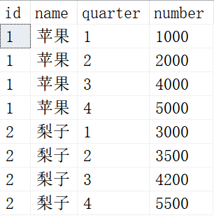

```sql
select ID,NAME,
[1] as '一季度',
[2] as '二季度',
[3] as '三季度',
[4] as '四季度'
from
test
pivot
(
sum(number)
for quarter in
([1],[2],[3],[4])
)
as pvt
```

结果：

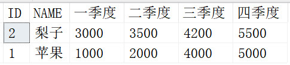

## 2、列转行的用法UNPIOVT

```sql
create table test2 (id int,name varchar(20), Q1 int, Q2 int, Q3 int, Q4 int);
insert into test2 values(1,'苹果',1000,2000,4000,5000);
insert into test2 values(2,'梨子',3000,3500,4200,5500);
select * from test2;
```

结果：

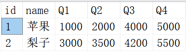

```sql
--列转行
select id,name,quarter,number
from
test2
unpivot
(
number
for quarter in
([Q1],[Q2],[Q3],[Q4])
)
as unpvt
```

结果：

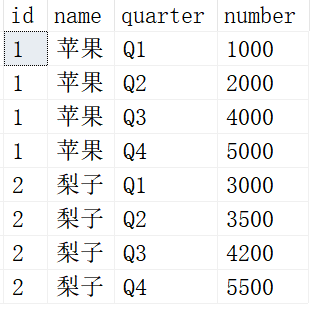


## 3、字符串替换SUBSTRING/REPLACE

```sql
SELECT REPLACE('abcdefg',SUBSTRING('abcdefg',2,4),'**')
```

结果：

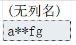


```sql
SELECT REPLACE('13512345678',SUBSTRING('13512345678',4,11),'********')
```

结果：

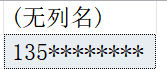


```sql
SELECT REPLACE('12345678@qq.com','1234567','******')
```

结果：

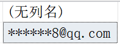


## 4、查询一个表内相同纪录 HAVING

如果一个ID可以区分的话，可以这么写

```sql
SELECT * FROM HR.Employees
```

结果：

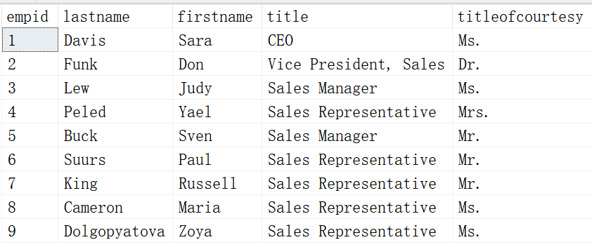


```sql
select * from HR.Employees
where title in (
select title from HR.Employees
group by title
having count(1)>1)
```

结果：

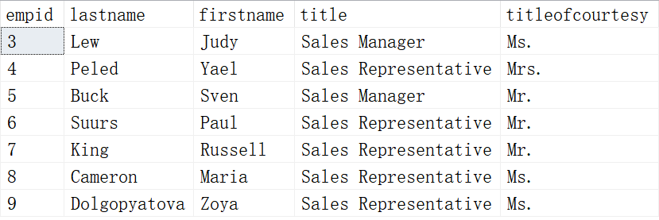

对比一下发现，ID为1，2的被过滤掉了，因为他们只有一条记录

如果几个ID才能区分的话，可以这么写

```sql
select * from HR.Employees
where title+titleofcourtesy in
(select title+titleofcourtesy
from HR.Employees
group by title,titleofcourtesy
having count(1)>1)
```

结果：

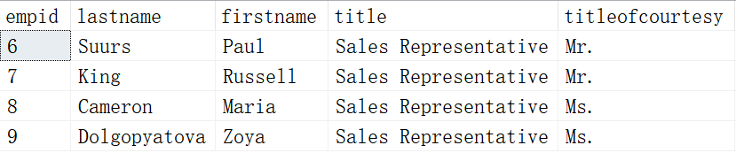

title在和titleofcourtesy进行拼接后符合条件的就只有ID为6,7,8,9的了


## 5、把多行SQL数据变成一条多列数据，即新增列

```sql
SELECT 
 id,
 name,
 SUM(CASE WHEN quarter=1 THEN number ELSE 0 END) '一季度',
 SUM(CASE WHEN quarter=2 THEN number ELSE 0 END) '二季度',
 SUM(CASE WHEN quarter=3 THEN number ELSE 0 END) '三季度',
 SUM(CASE WHEN quarter=4 THEN number ELSE 0 END) '四季度'
FROM test
GROUP BY id,name
```

结果：


我们将原来的4列增加到了6列。细心的朋友可能发现了这个结果和上面的行转列怎么一模一样？其实上面的行转列是省略写法，这种是比较通用的写法。 


## 6、表复制

**语法1：**Insert INTO table(field1,field2,...) values(value1,value2,...)

**语法2：**Insert into Table2(field1,field2,...) select value1,value2,... from Table1

> 要求目标表Table2必须存在，由于目标表Table2已经存在，所以我们除了插入源表Table1的字段外，还可以插入常量。

**语法3：**SELECT vale1, value2 into Table2 from Table1

> 要求目标表Table2不存在，因为在插入时会自动创建表Table2，并将Table1中指定字段数据复制到Table2中。

**语法4：**使用导入导出功能进行全表复制。如果是使用【编写查询以指定要传输的数据】，那么在大数据表的复制就会有问题？因为复制到一定程度就不再动了，内存爆了？它也没有写入到表中。而使用上面3种语法直接执行是会马上刷新到数据库表中的，你刷新一下mdf文件就知道了。


## 7、利用带关联子查询Update语句更新数据

```sql
--方法1：
Update Table1
set c = (select c from Table2 where a = Table1.a)
where c is null 

--方法2：
update A
set newqiantity=B.qiantity
from A,B
where A.bnum = B.bnum

--方法3：
update
(select A.bnum, A.newqiantity, B.qiantity from A left join B on A.bnum=B.bnum) AS C
set C.newqiantity = C.qiantity
where C.bnum ='001'
```


## 8、连接远程服务器

```sql
--方法1：
select * from openrowset(
'SQLOLEDB',
'server=192.168.0.1;uid=sa;pwd=password',
'SELECT * FROM dbo.test')

--方法2：
select * from openrowset(
'SQLOLEDB',
'192.168.0.1';
'sa';
'password',
'SELECT * FROM dbo.test')
```

当然也可以参考以前的示例，建立DBLINK进行远程连接


## 9、Date 和 Time 样式 CONVERT

`CONVERT()`：函数是把日期转换为新数据类型的通用函数。 

`CONVERT()`：函数可以用不同的格式显示日期/时间数据。

语法：

```sql
CONVERT(data_type(length), data_to_be_converted, style)
```

data_type(length) 规定目标数据类型（带有可选的长度）。data_to_be_converted 含有需要转换的值。style 规定日期/时间的输出格式。

可以使用的 style 值：

| Style ID    | Style 格式                            |
| :---------- | :------------------------------------ |
| 100 或者 0  | mon dd yyyy hh:miAM （或者 PM）       |
| 101         | mm/dd/yy                              |
| 102         | yy.mm.dd                              |
| 103         | dd/mm/yy                              |
| 104         | dd.mm.yy                              |
| 105         | dd-mm-yy                              |
| 106         | dd mon yy                             |
| 107         | Mon dd, yy                            |
| 108         | hh:mm:ss                              |
| 109 或者 9  | mon dd yyyy hh:mi:ss:mmmAM（或者 PM） |
| 110         | mm-dd-yy                              |
| 111         | yy/mm/dd                              |
| 112         | yymmdd                                |
| 113 或者 13 | dd mon yyyy hh:mm:ss:mmm(24h)         |
| 114         | hh:mi:ss:mmm(24h)                     |
| 120 或者 20 | yyyy-mm-dd hh:mi:ss(24h)              |
| 121 或者 21 | yyyy-mm-dd hh:mi:ss.mmm(24h)          |
| 126         | yyyy-mm-ddThh:mm:ss.mmm（没有空格）   |
| 130         | dd mon yyyy hh:mi:ss:mmmAM            |
| 131         | dd/mm/yy hh:mi:ss:mmmAM               |

```sql
SELECT CONVERT(varchar(100), GETDATE(), 0)
--结果：
12  7 2020  9:33PM
SELECT CONVERT(varchar(100), GETDATE(), 1)
--结果：
12/07/20
SELECT CONVERT(varchar(100), GETDATE(), 2)
--结果：
20.12.07
SELECT CONVERT(varchar(100), GETDATE(), 3)
--结果：
07/12/20
SELECT CONVERT(varchar(100), GETDATE(), 4)
--结果：
07.12.20
SELECT CONVERT(varchar(100), GETDATE(), 5)
--结果：
07-12-20
SELECT CONVERT(varchar(100), GETDATE(), 6)
--结果：
07 12 20
SELECT CONVERT(varchar(100), GETDATE(), 7)
--结果：
12 07, 20
SELECT CONVERT(varchar(100), GETDATE(), 8)
--结果：
21:33:18
SELECT CONVERT(varchar(100), GETDATE(), 9)
--结果：
12  7 2020  9:33:18:780PM
SELECT CONVERT(varchar(100), GETDATE(), 10)
--结果：
12-07-20
SELECT CONVERT(varchar(100), GETDATE(), 11)
--结果：
20/12/07
SELECT CONVERT(varchar(100), GETDATE(), 12)
--结果：
201207
SELECT CONVERT(varchar(100), GETDATE(), 13)
--结果：
07 12 2020 21:33:18:780
SELECT CONVERT(varchar(100), GETDATE(), 14)
--结果：
21:33:18:780
SELECT CONVERT(varchar(100), GETDATE(), 20)
--结果：
2020-12-07 21:33:18
SELECT CONVERT(varchar(100), GETDATE(), 21)
--结果：
2020-12-07 21:33:18.780
SELECT CONVERT(varchar(100), GETDATE(), 22)
--结果：
12/07/20  9:33:18 PM
SELECT CONVERT(varchar(100), GETDATE(), 23)
--结果：
2020-12-07
SELECT CONVERT(varchar(100), GETDATE(), 24)
--结果：
21:33:18
SELECT CONVERT(varchar(100), GETDATE(), 25)
--结果：
2020-12-07 21:33:18.780
SELECT CONVERT(varchar(100), GETDATE(), 100)
--结果：
12  7 2020  9:33PM
SELECT CONVERT(varchar(100), GETDATE(), 101)
--结果：
12/07/2020
SELECT CONVERT(varchar(100), GETDATE(), 102)
--结果：
2020.12.07
SELECT CONVERT(varchar(100), GETDATE(), 103)
--结果：
07/12/2020
SELECT CONVERT(varchar(100), GETDATE(), 104)
--结果：
07.12.2020
SELECT CONVERT(varchar(100), GETDATE(), 105)
--结果：
07-12-2020
SELECT CONVERT(varchar(100), GETDATE(), 106)
--结果：
07 12 2020
SELECT CONVERT(varchar(100), GETDATE(), 107)
--结果：
12 07, 2020
SELECT CONVERT(varchar(100), GETDATE(), 108)
--结果：
21:33:18
SELECT CONVERT(varchar(100), GETDATE(), 109)
--结果：
12  7 2020  9:33:18:780PM
SELECT CONVERT(varchar(100), GETDATE(), 110)
--结果：
12-07-2020
SELECT CONVERT(varchar(100), GETDATE(), 111)
--结果：
2020/12/07
SELECT CONVERT(varchar(100), GETDATE(), 112)
--结果：
20201207
SELECT CONVERT(varchar(100), GETDATE(), 113)
--结果：
07 12 2020 21:33:18:780
SELECT CONVERT(varchar(100), GETDATE(), 114)
--结果：
21:33:18:780
SELECT CONVERT(varchar(100), GETDATE(), 120)
--结果：
2020-12-07 21:33:18
SELECT CONVERT(varchar(100), GETDATE(), 121)
--结果：
2020-12-07 21:33:18.780
```

## 10、SQL中的相除

### 10.1、方法一

```sql
--SQL中的相除
SELECT 
CASE WHEN ISNULL(A-B,0)=0 THEN ''
ELSE CAST(CONVERT(DECIMAL(18,2),A*100.0/(A-B)) AS VARCHAR(10))+'%'  
END AS '百分数'  --FROM 表
```

​		这里我们先要判断被除数是否为0，如果为0给出一个想输出的结果，这里我们返回空白(是字符类型，不是NULL)，在不为0的时候就给出具体的计算公式，然后转换成字符类型再和“%”进行拼接。例如：

```sql
SELECT 
CASE WHEN ISNULL(5-2,0)=0 THEN ''
ELSE CAST(CONVERT(DECIMAL(18,2),5*100.0/(5-2)) AS VARCHAR(10))+'%'  
END AS '百分数'  --FROM 表
```

返回的结果：

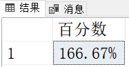


### 10.2、方法二

```sql
SELECT 
(CONVERT(VARCHAR(20),ROUND(41*100.0/88,3))+'%') AS '百分比' 
--FROM A
```

执行结果：

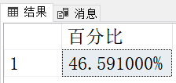


## 11、四舍五入ROUND函数

ROUND ( numeric_expression , length [ ,function ] )
function 必须为 tinyint、smallint  或 int。
如果省略 function 或其值为 0（默认值），则将舍入 numeric_expression。
如果指定了0以外的值，则将截断 numeric_expression。

```sql
SELECT ROUND(150.45648, 2);
--保留小数点后两位，需要四舍五入
--结果：
150.46000

SELECT ROUND(150.45648, 2, 0);
--保留小数点后两位，0为默认值，表示进行四舍五入
--结果：
150.46000

SELECT ROUND(150.45648, 2, 1);
--保留小数点后两位，不需要四舍五入，这里除0以外都是有同样的效果，
--与Oracle的TRUNC函数效果相同
--结果：
150.45000

SELECT ROUND(150.45648, 2, 2);
--保留小数点后两位，不需要四舍五入，这里除0以外都是有同样的效果，
--与Oracle的TRUNC函数效果相同
--结果：
150.45000
```


## 12、对字段出现NULL值的处理

**方法一**

```sql
--CASE
SELECT 
CASE WHEN  '字段名' IS NULL THEN 'NULL' 
ELSE CONVERT(VARCHAR(20),'字段名1') END 
AS 'NewName'
--结果：
字段名1

SELECT CASE WHEN NULL IS NULL THEN 'N' 
ELSE CONVERT(VARCHAR(20),NULL) END 
AS 'NewName'
--结果：
N
```

**方法二**

```sql
--SQL Server 2005：COALESCE
SELECT COALESCE('字符串类型字段','N') AS 'NewName'
--结果：
字符串类型字段

SELECT COALESCE(CONVERT(VARCHAR(20),'非字符串类型字段'),'N') AS 'NewName'
--结果：
非字符串类型字段

SELECT COALESCE(CONVERT(VARCHAR(20),NULL),'N') AS 'NewName'
--结果：
N

--COALESCE,返回其参数中的第一个非空表达式
SELECT COALESCE(NULL,NULL,1,2,NULL)
--结果：
1

SELECT COALESCE(NULL,11,12,13,NULL)
--结果：
11

SELECT COALESCE(111,112,113,114,NULL)
--结果：
111
```


## 13、COUNT的几种情况

```sql
--以下三种方法均可统计出表的记录数
--第一种
select count(*) from tablename

--第二种
select count(ID) from tablename

--第三种,1换成其它值也是可以的
select count(1) from tablename
```


## 14、UNION ALL多表插入

把两个相同结构的表union后插入到一个新表中，当然两个以上的相同结构的表也是可以的，这里的相同是指两个或多个表的列数和每个对应列的类型相同，列名称可以不同

```sql
select *
into table_new
from table_1
union all
select * from table_2
```


## 15、SQL换行

SQL的换行
制表符 CHAR(9)
换行符 CHAR(10)
回车 CHAR(13)

```sql
PRINT 'SQL'+CHAR(13)+'ROAD'
PRINT 'SQL'+CHAR(10)+'ROAD'
PRINT 'SQL'+CHAR(9)+'ROAD'
```

执行结果：

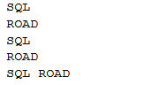


如果将查询结果以文本格式显示，而不是网格格式显示，SELECT语句也适用，我们先将查询结果改成以文本格式显示


```sql
--以文本格式显示结果
SELECT 'SQL'+ CHAR(10)+'ROAD'
SELECT 'SQL'+ CHAR(13)+'ROAD'
SELECT 'SQL' + CHAR(10) + CHAR(13) + 'ROAD'
```

结果如下：

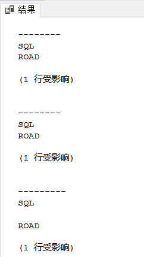


## 16、TRUNCATE 与 DELETE

TRUNCATE 是SQL中的一个删除数据表内容的语句，用法是：

TRUNCATE TABLE [Table Name] 速度快,而且效率高,因为: 
TRUNCATE TABLE 在功能上与不带 WHERE 子句的 DELETE 语句相同：二者均删除表中的全部行。但 TRUNCATE TABLE 比 DELETE 速度快，且使用的系统和事务日志资源少。 


DELETE 语句每次删除一行，并在事务日志中为所删除的每行记录一项。TRUNCATE TABLE 通过释放存储表数据所用的数据页来删除数据，并且只在事务日志中记录页的释放。


TRUNCATE TABLE 删除表中的所有行，但表结构及其列、约束、索引等保持不变。新行标识所用的计数值重置为该列的种子。


如果想保留标识计数值，请改用 DELETE。


如果要删除表定义及其数据，请使用 DROP TABLE 语句。

 
对于由 FOREIGN KEY 约束引用的表，不能使用 TRUNCATE TABLE，而应使用不带 WHERE 子句的 DELETE 语句。由于 TRUNCATE TABLE 不记录在日志中，所以它不能激活触发器。TRUNCATE TABLE 不能用于参与了索引视图的表。 


## 17、常用系统检测脚本

```sql
--查看内存状态
dbcc memorystatus

--查看哪个引起的阻塞，blk
EXEC sp_who active

--查看锁住了那个资源id，objid
EXEC sp_lock
```

还有如何查看查询分析器的SPID，可以在查询分析器的状态栏看到，比如sa(57),这就表示当前查询分析器SPID为57,这样在使用profile的时候就可以指定当前窗体进行监控。状态栏在查询窗口的右下角。


## 18、获取脚本的执行时间

```sql
declare @timediff datetime
select @timediff=getdate()
select * from Suppliers
print '耗时:'+ convert(varchar(10),datediff(ms,@timediff,getdate()))
```

结果如下：

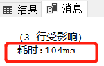

在状态栏是不会精确到毫秒的，只能精确到秒


这个脚本可以更加有效的查看SQL代码的执行效率。
